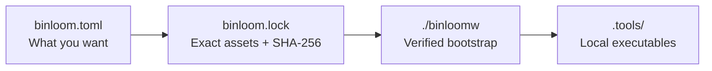

<p align="center">
  
</p>

<h1 align="center">🧶 Binloom</h1>

<p align="center">
  <strong>Pinned, checksum-verified developer tools that live with your repository.</strong>
</p>

<p align="center">
  <a href="https://github.com/KyrboForge/binloom/actions/workflows/ci.yml"></a>
  <a href="https://github.com/KyrboForge/binloom/releases/latest"></a>
  <a href="https://crates.io/crates/binloom"></a>
  <a href="LICENSE-MIT"></a>
</p>

Binloom is a small, repository-local manager for downloadable developer tools.
It gives every contributor and CI job the same pinned executables without a
global Binloom installation or a language-specific package manager.

It works the same way in Rust, Go, Python, JavaScript, Java, and mixed
repositories.

**No global installs. No language lock-in. No version drift.**

## 📦 Installation

### Bootstrap without a global install

The recommended bootstrap downloads a temporary, checksum-verified Binloom
binary and runs the requested command without installing anything globally:

```sh
curl -fsSL https://raw.githubusercontent.com/KyrboForge/binloom/main/bootstrap.sh \
  -o /tmp/binloom-bootstrap
sh /tmp/binloom-bootstrap init
rm /tmp/binloom-bootstrap
```

### Optional global install

If you want `binloom` available everywhere, choose one of these:

#### crates.io

```sh
cargo install binloom
```

#### Git repository

```sh
cargo install --git https://github.com/KyrboForge/binloom
```

🚧 Homebrew support through `KyrboForge/tap` is in progress.

Global Binloom is convenient for commands such as `binloom init`. The
committed `binloomw` still uses the version pinned by the repository so every
contributor and CI job runs the same binary. Contributors therefore only need
`./binloomw`, not a global installation.

## ✨ Why Binloom?

Projects often need command-line tools that are not application dependencies:
hook runners, linters, formatters, code generators, and protocol compilers.
Installing and aligning them globally creates onboarding work and CI drift.

Binloom keeps the whole flow reproducible and local:



The manifest describes intent. The committed lockfile records exact versions,
URLs, formats, and checksums. Downloads are verified before installation.

## 🚀 Quick start

The maintainer initializes the repository using any available Binloom binary:

```sh
binloom init
binloom add lefthook \
  --source github:evilmartians/lefthook \
  --version 2.1.11
binloom update --self

git add binloomw binloom.toml binloom.lock .gitignore
```

Contributors only need the committed files:

```sh
./binloomw install
./binloomw exec lefthook -- run pre-commit
```

`binloomw` downloads the Binloom version pinned for the current platform,
verifies its SHA-256 checksum, caches it under
`.tools/binloom/<version>/binloom`, and forwards the command. No global
installation or shell setup is required.

Managed tools are installed under `.tools/<tool>/<version>/` and linked into
`.tools/.bin`. Use them through `binloomw exec`, or add the printed path for a
single shell command:

```sh
PATH="$(./binloomw path):$PATH" lefthook version
```

## ⚙️ Configuration

`binloom.toml` stays intentionally small:

```toml
#:schema https://raw.githubusercontent.com/KyrboForge/binloom/main/schemas/binloom.schema.json

manifest-version = 1

[binloom]
version = "0.2.0"

[tools.lefthook]
version = "2.1.11"
source = "github:evilmartians/lefthook"
```

Binloom discovers platform assets from GitHub Releases. When a release is
ambiguous, an optional pattern can narrow the match:

```toml
[tools.example]
version = "1.2.3"
source = "github:owner/example"
asset = "example_{version}_{os}_{arch}.gz"
```

Updates ignore releases younger than 24 hours by default. Repositories can
change that safety window:

```toml
[update]
minimum-release-age-minutes = 1440
```

## 🧰 Commands

| Command | Purpose |
| --- | --- |
| `binloom init` | Create missing manifest and wrapper files; add `.tools/` to `.gitignore` |
| `binloom add <name> --source <source> --version <version>` | Append a tool, refresh the lockfile, and install it |
| `binloom install` | Install every locked tool; resolve latest allowed releases when the lockfile is missing |
| `binloom update [tool]` | Update one tool, or all tools and Binloom when omitted |
| `binloom update --self` | Update only Binloom and its wrapper metadata |
| `binloom exec <command> [args...]` | Run with `.tools/.bin` prepended to `PATH` |
| `binloom list` | List configured tools and versions |
| `binloom path` | Print the absolute `.tools/.bin` path |

Updates modify `binloom.toml` and `binloom.lock`. Commit both so contributors
and CI receive the same toolchain.

## 📁 Repository files

| Path | Purpose | Commit? |
| --- | --- | --- |
| `binloomw` | Generated POSIX bootstrap wrapper | yes |
| `binloom.toml` | Human-written requirements | yes |
| `binloom.lock` | Resolved artifacts and checksums | yes |
| `.tools/` | Downloaded binaries and links | no |

When `[wrapper]` metadata is present in the lockfile, `binloomw` also verifies
its generated version and checksum. A changed or outdated wrapper replaces
itself atomically from the locked release asset and restarts.

## 🎯 Scope

Binloom currently supports public GitHub Releases on macOS and Linux for ARM64
and x86-64. Assets may be raw executables or single gzip-compressed
executables.

It is not a language package manager, runtime manager, daemon, GUI, or remote
package registry. See the [MVP design](docs/design.md) for the detailed
contract.

## 🧪 Development

Run the test suite and measure line coverage locally with:

```sh
rustup component add llvm-tools-preview
cargo install cargo-llvm-cov
rustup run stable cargo llvm-cov --all-targets --locked --summary-only
```

CI rejects changes that lower line coverage below 60% and uploads the report
to GitHub Code Quality.

## 📜 License

Licensed under either [MIT](LICENSE-MIT) or
[Apache License 2.0](LICENSE-APACHE), at your option.
